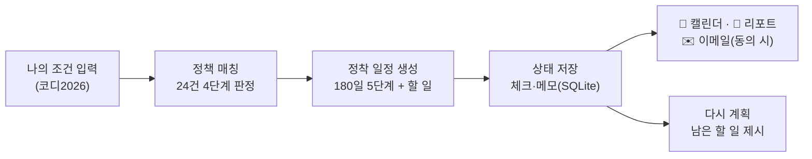
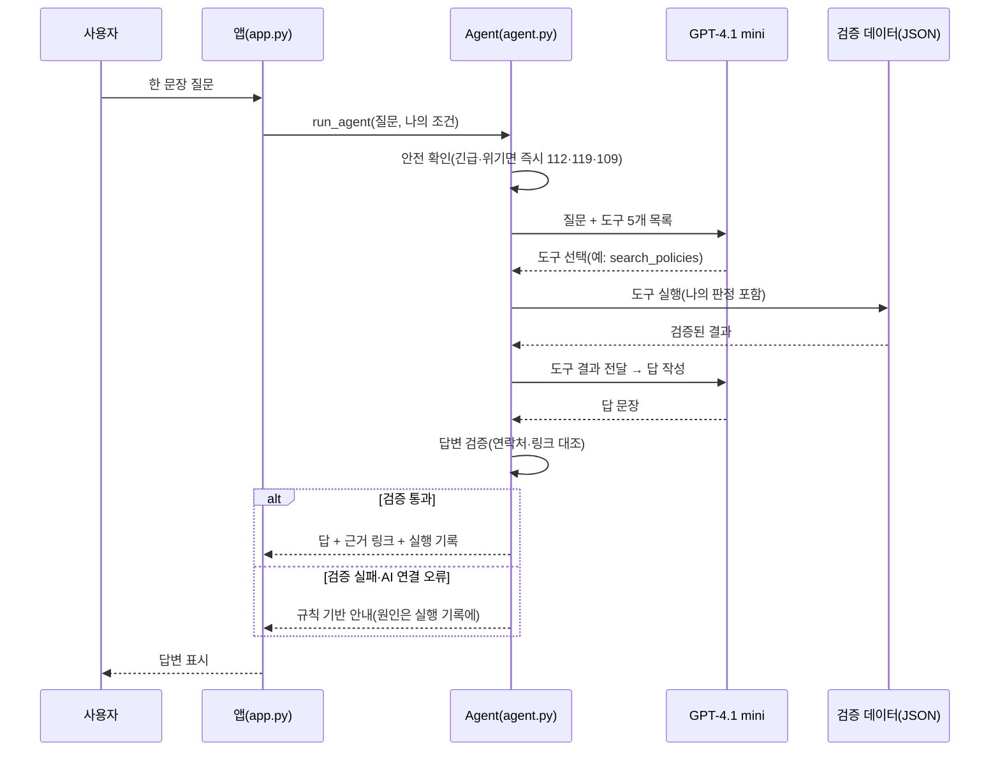

# 오이소창원 — AI 기반 창원 정착 지원 Agent

> 창⁠원⁠에 새⁠로 전⁠입⁠한 청⁠년⁠이 첫 180일 동⁠안 놓⁠치⁠기 쉬⁠운 혜⁠택⁠과 할 일⁠을,
> 나⁠의 조⁠건⁠으⁠로 판⁠정⁠하⁠고 일⁠정⁠으⁠로 만⁠들⁠어 함⁠께 챙⁠겨 주⁠는 코⁠디⁠네⁠이⁠터 Agent
> — 슬⁠로⁠건: **창⁠원⁠에⁠서 너⁠의 내⁠일⁠을 응⁠원⁠해!**


- **🔗 배⁠포 앱:** https://oisochangwon-4fuybothxlr78qnnaappqv.streamlit.app/ (QR로 휴⁠대⁠폰 접⁠속)
- **💻 GitHub:** https://github.com/jojunsu98/oiso_changwon
- **📄 완⁠료⁠보⁠고⁠서(제⁠출1):** [보⁠고⁠서 보⁠기(PDF)](deliverables/final_report/1.%EC%98%A4%EC%9D%B4%EC%86%8C%EC%B0%BD%EC%9B%90_%EA%B0%9C%EB%B0%9C%EC%99%84%EB%A3%8C%EB%B3%B4%EA%B3%A0%EC%84%9C.pdf)
- **📋 기⁠획⁠안(최⁠종⁠본):** [기⁠획⁠안 보⁠기](docs/planning/%EC%98%A4%EC%9D%B4%EC%86%8C%EC%B0%BD%EC%9B%90_%EA%B8%B0%ED%9A%8D%EC%95%88_%EC%B5%9C%EC%A2%85%EB%B3%B8_20261004.md)
- **📑 결⁠과⁠보⁠고⁠서(기⁠획⁠안 대⁠응):** [결⁠과⁠보⁠고⁠서 보⁠기](docs/result/%EC%98%A4%EC%9D%B4%EC%86%8C%EC%B0%BD%EC%9B%90_%EA%B2%B0%EA%B3%BC%EB%B3%B4%EA%B3%A0%EC%84%9C_%EC%B5%9C%EC%A2%85%EB%B3%B8_20261005.md)
- **🛠 Streamlit 관⁠리(개⁠발⁠자, 로⁠그⁠인 필⁠요):** https://share.streamlit.io → oisochangwon
- **✉️ 앱 문⁠의:** whwnstn9294@gmail.com

제4회 경⁠남 AI·SW 경⁠진⁠대⁠회 일⁠반⁠부 · 지⁠정⁠주⁠제 01(사⁠회⁠문⁠제 해⁠결⁠형 AI Agent) · 팀 오⁠이⁠소⁠창⁠원(조⁠준⁠수 팀⁠장 · 이⁠혜⁠경 · 이⁠미⁠영)


---

## 목차

1. [프⁠로⁠젝⁠트 소⁠개](#1-프로젝트-소개)
2. [해⁠결⁠하⁠려⁠는 문⁠제 (3가⁠지)](#2-해결하려는-문제-3가지)
3. [프⁠로⁠젝⁠트 개⁠요 및 산⁠출⁠물 구⁠성](#3-프로젝트-개요-및-산출물-구성)
4. [폴⁠더 구⁠조](#4-폴더-구조)
5. [기⁠술 스⁠택](#5-기술-스택)
6. [데⁠이⁠터 설⁠명 및 출⁠처](#6-데이터-설명-및-출처)
7. [핵⁠심 기⁠능⁠과 기⁠존 서⁠비⁠스⁠와 다⁠른 점](#7-핵심-기능과-기존-서비스와-다른-점)
8. [전⁠체 작⁠업 순⁠서 (STEP 1-16)](#8-전체-작업-순서-step-1-16)
9. [작⁠업 흐⁠름⁠도 (Agent Workflow)](#9-작업-흐름도-agent-workflow)
10. [AI(GPT-4.1 mini) Agent 연⁠동 구⁠조](#10-aigpt-41-mini-agent-연동-구조)
11. [화⁠면 구⁠성](#11-화면-구성)
12. [저⁠장·알⁠림 기⁠능](#12-저장알림-기능)
13. [로⁠컬 실⁠행 방⁠법](#13-로컬-실행-방법)
14. [배⁠포 방⁠법 및 환⁠경 변⁠수](#14-배포-방법-및-환경-변수)
15. [개⁠발 중 발⁠생⁠한 오⁠류⁠와 해⁠결](#15-개발-중-발생한-오류와-해결)
16. [AI 도⁠구 사⁠용 로⁠그 요⁠약](#16-ai-도구-사용-로그-요약)
17. [테⁠스⁠트 결⁠과⁠와 대⁠회 요⁠구⁠사⁠항 대⁠비 결⁠과](#17-테스트-결과와-대회-요구사항-대비-결과)
18. [결⁠론 및 한⁠계⁠점](#18-결론-및-한계점)
19. [보⁠안 유⁠의⁠사⁠항](#19-보안-유의사항)
20. [정⁠보⁠출⁠처 (출⁠처·AI 활⁠용 신⁠고⁠서)](#20-정보출처-출처ai-활용-신고서)

---

## 1. 프로젝트 소개

경⁠남⁠은 청⁠년 순⁠유⁠출⁠이 계⁠속⁠되⁠는 지⁠역⁠이⁠고, 창⁠원⁠은 그⁠중⁠에⁠서⁠도 순⁠유⁠출⁠이 많⁠은 도⁠시⁠입⁠니⁠다. 막 이⁠사 온 청⁠년⁠은 전⁠입⁠신⁠고·교⁠통·주⁠거 혜⁠택⁠처⁠럼 **기⁠한⁠이 있⁠는 일**을 언⁠제 해⁠야 하⁠는⁠지 모⁠르⁠고 지⁠나⁠치⁠기 쉽⁠고, 정⁠보⁠는 여⁠러 누⁠리⁠집⁠에 흩⁠어⁠져 있⁠습⁠니⁠다.

오⁠이⁠소⁠창⁠원⁠은 **나⁠의 조⁠건(나⁠이·전⁠입⁠일·하⁠는 일·차⁠량 등)**만 입⁠력⁠하⁠면 창⁠원·청⁠년 정⁠책 24건⁠을 실⁠제⁠로 판⁠정⁠해 4단⁠계⁠로 나⁠누⁠고, 전⁠입⁠일 기⁠준 180일 정⁠착 일⁠정⁠과 할 일⁠로 만⁠들⁠어 줍⁠니⁠다. 궁⁠금⁠한 것⁠은 **오⁠이⁠소⁠창⁠원(코⁠디⁠네⁠이⁠터 Agent)**에⁠게 한 문⁠장⁠으⁠로 물⁠으⁠면, AI(GPT-4.1 mini)가 질⁠문⁠을 분⁠석⁠해 팀⁠이 검⁠증⁠한 자⁠료 도⁠구⁠를 골⁠라 쓰⁠고, 답 속 연⁠락⁠처·링⁠크⁠를 검⁠증⁠한 뒤 안⁠내⁠합⁠니⁠다.

- **대⁠상:** 창⁠원⁠에 새⁠로 전⁠입⁠한(또⁠는 전⁠입 예⁠정⁠인) 청⁠년, 시⁠연 페⁠르⁠소⁠나 ‘코⁠디2026’(28세·2026-09-20 전⁠입·직⁠장⁠인·차⁠량 없⁠음)
- **핵⁠심 가⁠치:** 흩⁠어⁠진 정⁠보⁠를 “내 조⁠건 → 판⁠정 → 일⁠정 → 저⁠장”으⁠로 한 번⁠에, 실⁠명·연⁠락⁠처 없⁠이
- **4대 기⁠능 + Agent:** ① 맞⁠춤 혜⁠택 알⁠림 / ② 생⁠활 정⁠보 안⁠내·일⁠정 편⁠성 / ③ 불⁠편⁠사⁠항 접⁠수 안⁠내 / ④ 지⁠역⁠말 번⁠역 + 오⁠이⁠소⁠창⁠원⁠에⁠게 물⁠어⁠보⁠기
- **저⁠장·알⁠림:** 📅 캘⁠린⁠더(.ics, 하⁠루 전 오⁠전 9시 알⁠림) · 📄 정⁠착 리⁠포⁠트 · ✉️ 이⁠메⁠일 알⁠림(선⁠택, 동⁠의 2개)

---

## 2. 해결하려는 문제 (3가지)

1. 전⁠입 청⁠년⁠이 **내 조⁠건⁠으⁠로 받⁠을 수 있⁠는 혜⁠택**을 스⁠스⁠로 찾⁠고 판⁠단⁠하⁠기 어⁠렵⁠다 → 정⁠책 24건 4단⁠계 판⁠정 + 이⁠유 + 지⁠금 할 일
2. 창⁠원⁠에 전⁠입⁠하⁠고 나⁠면 **받⁠을 수 있⁠는 혜⁠택⁠과 해⁠야 할 일⁠에 기⁠한**이 있⁠는⁠데, 언⁠제 무⁠엇⁠을 해⁠야 하⁠는⁠지 놓⁠친⁠다 → 전⁠입⁠일 기⁠준 180일 일⁠정 + 캘⁠린⁠더 알⁠림
3. 낯⁠선 도⁠시⁠에⁠서 **생⁠활 정⁠보·불⁠편 접⁠수 창⁠구·지⁠역⁠말**을 물⁠어⁠볼 곳⁠이 없⁠다 → 검⁠증 자⁠료⁠만 쓰⁠는 Agent가 한 문⁠장 질⁠문⁠에 답⁠하⁠고 근⁠거 링⁠크 제⁠시

---

## 3. 프로젝트 개요 및 산출물 구성

| 항⁠목 | 내⁠용 |
| :---: | --- |
| 과⁠제⁠명 | 오⁠이⁠소⁠창⁠원 — AI 기⁠반 창⁠원 정⁠착 지⁠원 Agent |
| 지⁠정⁠주⁠제 | 01 사⁠회⁠문⁠제 해⁠결⁠형 AI Agent (일⁠반⁠부) |
| 개⁠발 유⁠형 | B형(App + LLM API) + 답⁠변 검⁠증 단⁠계 |
| 팀 역⁠할 | A 조⁠준⁠수(팀⁠장) 전⁠체 검⁠수·UX/UI 개⁠선(10/5)·시⁠연⁠동⁠영⁠상·발⁠표⁠자⁠료 최⁠종 편⁠집 · B 이⁠혜⁠경 기⁠획·데⁠이⁠터 검⁠증·기⁠능 개⁠발 및 테⁠스⁠트·문⁠서·브⁠랜⁠드 로⁠고/QR 제⁠작·온⁠라⁠인 응⁠답 설⁠문 제⁠작 · C 이⁠미⁠영 기⁠능⁠별 화⁠면 점⁠검·개⁠선 리⁠포⁠트·실⁠사⁠용⁠자 섭⁠외·시⁠연⁠동⁠영⁠상 녹⁠화·발⁠표⁠자⁠료 제⁠작 |
| AI | 앱: **LLM(OpenAI GPT-4.1 mini)** — 질⁠문 이⁠해 → 목⁠표·의⁠도 파⁠악 → 도⁠구 선⁠택 → 답⁠변 구⁠성(정⁠책 자⁠격⁠은 규⁠칙 판⁠정) / 개⁠발 보⁠조: Claude Opus 5.5(추⁠론 수⁠준 중⁠간) · ChatGPT(GPT-5.6 Sol · GPT-6 Astra Pro) · OpenAI Codex · Gemini 3.8 Flash |
| 기⁠간 | 2026-09-29 ~ 10-05(개⁠발·검⁠증, 10/5 UX/UI 개⁠선) |
| 제⁠출 | 2026-10-06(화) 낮 12시⁠까⁠지 구⁠글⁠폼(https://forms.gle/FUVSCAtjd8w8ksRg8) — 기⁠본⁠정⁠보 입⁠력 + 산⁠출⁠물 zip 1개 `일반부_10_조준수.zip` |
| 본⁠선 | 발⁠표 및 시⁠연 6분 + 질⁠의⁠응⁠답 2분(시⁠연⁠은 제⁠출⁠한 시⁠연⁠동⁠영⁠상) |

**산⁠출⁠물 구⁠성**

| 산⁠출⁠물 | 형⁠식 | 위⁠치 |
| --- | :---: | --- |
| 웹 앱 | Streamlit, Streamlit Community Cloud 배⁠포 | `app.py`, `src/`, `data/` |
| 기⁠획⁠안(최⁠종⁠본) | md·pdf·docx | `docs/planning/` |
| 결⁠과⁠보⁠고⁠서(기⁠획⁠안 대⁠응) | md·pdf·docx — 기⁠획⁠안 Ⅰ~Ⅸ장⁠별 계⁠획 → 실⁠제 결⁠과 | `docs/result/` |
| 0. 참⁠가⁠신⁠청⁠서 | pdf (개⁠인⁠정⁠보·서⁠명 가⁠림 처⁠리⁠본, 원⁠본⁠은 협⁠회 제⁠출) | `deliverables/submission/` |
| 출⁠처·AI 활⁠용 신⁠고⁠서 | pdf (5쪽, 협⁠회 제⁠출⁠본⁠과 같⁠은 내⁠용) | `deliverables/submission/` |
| 1. 완⁠료⁠보⁠고⁠서(제⁠출1) | pdf·docx (별⁠지 4, 5쪽) | `deliverables/final_report/` |
| 2. 기⁠술⁠명⁠세⁠서(제⁠출2) | pdf·docx (별⁠지 1, 2쪽 — 정⁠보⁠출⁠처·작⁠업⁠별 AI 상⁠세 포⁠함) | `deliverables/technical_description/` |
| 3. 소⁠스 및 경⁠로(제⁠출3) | pdf·docx (2쪽) | `deliverables/technical_description/` |
| 4. 시⁠연⁠동⁠영⁠상(제⁠출4) | mp4 (2분 57초) | `deliverables/presentation/video/` |
| 5. 발⁠표⁠자⁠료(제⁠출5) | 5-1 발⁠표⁠자⁠료 pptx · 5-2 발⁠표⁠대⁠본 pdf·docx | `deliverables/presentation/ppt/` |
| 테⁠스⁠트 3종 | 코⁠드·체⁠크⁠리⁠스⁠트·보⁠고⁠서·설⁠문 결⁠과 | `tests/` |
| 증⁠빙 캡⁠처 | PNG·JPG 163장 | `screenshots/` |

---

## 4. 폴더 구조

폴⁠더 이⁠름⁠은 영⁠어⁠로 두⁠었⁠습⁠니⁠다(앱 파⁠일 위⁠치⁠를 바⁠꾸⁠면 배⁠포 주⁠소⁠가 바⁠뀔 수 있⁠어⁠서). 괄⁠호 안⁠이 한⁠글 뜻⁠입⁠니⁠다.

```
oiso_changwon/
├── README.md                    ← 지금 보고 있는 파일
├── app.py (화면·배포 시작 파일)  Streamlit 화면 — 위치 변경 금지
├── requirements.txt (배포 설정)  streamlit · python-dateutil · openai · anthropic
├── .streamlit/ (화면 테마)       남색 #063465 · 주황 #FE6A01
├── assets/ (이미지)              로고
│
├── src/ (처리 로직, 12개 모듈)
│   ├── agent.py                 Agent: 안전 확인 → 도구 선택·호출 → 답변 검증 → 규칙 대체, 실행 기록
│   ├── policy_matcher.py        정책 24건 4단계 판정 · 일정 이벤트
│   ├── policy_engine.py         기업노동자 전입지원금(P01) 판정
│   ├── settlement_engine.py     전입일 기준 정착 일정
│   ├── mission_manager.py       1~6개월 할 일(하는 일별 문구)
│   ├── progress_manager.py      진행률 · 현재 단계
│   ├── state_manager.py         체크·메모 저장(SQLite)
│   ├── schedule_export.py       캘린더(.ics) · 정착 리포트
│   ├── email_alerts.py          동의 기반 이메일 알림(신청·해지·발송)
│   ├── activity_manager.py      생활 정보 60곳 필터
│   ├── naver_map_links.py       네이버 지도 검색 링크
│   └── policy_resource_manager.py  할 일 공식 링크 검증
│
├── data/ (팀 검증 데이터, JSON)  정책 24 · 할 일 26 · 할 일 링크 18 · 생활 정보 60 · 지역말 30+2,223 · 접수 창구 6
│
├── tests/ (테스트 3종)
│   ├── README.md                       테스트 3종 결과(AI 자동 12회 · 팀 자체 38회 · 실사용자 4회)
│   ├── ai_test/ (AI 자동 테스트)        unittest 127개
│   ├── team_self_test/ (팀 자체 테스트)  Test Case · 체크리스트 · 자체평가 테스트보고서
│   └── user_test/ (실사용자 테스트)      오이소창원_사용자테스트_서류양식(설문 Apps Script·평가지) · results_20261004(4명 결과·그래프)
│
├── docs/ (문서)
│   ├── planning/ (기획)          기획안 최종본 · 그림
│   ├── result/ (결과)            기획안 대응 결과보고서
│   └── images/ (그림)            Workflow·QR·실사용자 그래프(문서·README에서 사용)
│
├── deliverables/ (최종 제출물)
│   ├── submission/ (0. 참가신청서 — 개인정보 가림 처리본 · 출처·AI 활용 신고서)
│   ├── final_report/ (1. 완료보고서)
│   ├── technical_description/ (2. 기술명세서 · 3. 소스 및 경로)
│   └── presentation/ ── video/ (4. 시연동영상) · ppt/ (5-1 발표자료 · 5-2 발표대본)
│
└── screenshots/ (화면 캡처)
    ├── during_development/ (구현 과정)  ai_test 26장 · work_process 27장 · team_self_test 37장 · ui_update 11장 · deploy_check 15장 · 작업과정_20261004_새디자인 5장 · 작업과정_20261004_최종구현사진 21장
    └── after_development/ (구현 완료)   최종완료사진_1005 — PC 10장 · 휴대폰 11장
```

---

## 용어 설명 (처음 보는 분을 위한 참고)

| 용⁠어 | 쉬⁠운 설⁠명 |
| :---: | --- |
| Agent | 목⁠표⁠를 이⁠해⁠하⁠고, 필⁠요⁠한 도⁠구⁠를 골⁠라 쓰⁠고, 결⁠과⁠를 확⁠인⁠해 다⁠음 행⁠동⁠을 정⁠하⁠는 AI 프⁠로⁠그⁠램 |
| 도⁠구 호⁠출(Tool Use) | AI가 직⁠접 지⁠어⁠내⁠지 않⁠고, 정⁠해⁠진 함⁠수(정⁠책 검⁠색·장⁠소 검⁠색 등)를 불⁠러 결⁠과⁠를 받⁠아 쓰⁠는 방⁠식 |
| 답⁠변 검⁠증 | AI 답 속 전⁠화⁠번⁠호·링⁠크⁠가 도⁠구 결⁠과(검⁠증 DB)에 실⁠제⁠로 있⁠는⁠지 대⁠조⁠하⁠는 단⁠계 |
| 4단⁠계 판⁠정 | 해⁠당 가⁠능 · 조⁠건⁠부 해⁠당 가⁠능 · 직⁠접 확⁠인 필⁠요 · 해⁠당 없⁠음 |
| 전⁠입⁠일 | 새 주⁠소⁠로 전⁠입⁠신⁠고⁠를 한 날. 정⁠착 일⁠정·혜⁠택 신⁠청 시⁠기⁠를 계⁠산⁠하⁠는 기⁠준 |
| .ics | 휴⁠대⁠폰·PC 캘⁠린⁠더⁠에 일⁠정⁠을 넣⁠는 표⁠준 파⁠일 형⁠식 |
| Streamlit | 파⁠이⁠썬⁠만⁠으⁠로 웹 화⁠면⁠을 만⁠드⁠는 도⁠구. 화⁠면⁠과 로⁠직⁠을 같⁠은 언⁠어⁠로 작⁠성 |
| Secrets | API 키·메⁠일 비⁠밀⁠번⁠호⁠를 코⁠드 밖(배⁠포 설⁠정)에 숨⁠겨 두⁠는 저⁠장 공⁠간 |
| SQLite | 파⁠일 하⁠나⁠로 동⁠작⁠하⁠는 작⁠은 데⁠이⁠터⁠베⁠이⁠스. 할 일 체⁠크·메⁠모·이⁠메⁠일 신⁠청 저⁠장 |
| SMTP | 메⁠일⁠을 보⁠내⁠는 표⁠준 방⁠식(Gmail은 앱 비⁠밀⁠번⁠호 필⁠요) |

---

## 5. 기술 스택

| 구⁠분 | 내⁠용 |
| :---: | --- |
| 언⁠어 | Python 3 |
| 화⁠면·배⁠포 | Streamlit 1.64 · Streamlit Community Cloud |
| AI | OpenAI GPT-4.1 mini(Function calling), 대⁠체 연⁠결 코⁠드(Anthropic SDK) |
| 데⁠이⁠터 | JSON(팀 검⁠증 데⁠이⁠터), SQLite(체⁠크·메⁠모·이⁠메⁠일 신⁠청) |
| 날⁠짜 계⁠산 | python-dateutil |
| 내⁠보⁠내⁠기 | iCalendar(.ics) 직⁠접 생⁠성, HTML 정⁠착 리⁠포⁠트 |
| 메⁠일 | Python smtplib(Gmail SMTP 587/465) |
| 테⁠스⁠트 | unittest · Streamlit AppTest · Playwright(화⁠면 캡⁠처) |
| 설⁠문 | Google Forms · Sheets · Apps Script |
| 버⁠전⁠관⁠리 | Git / GitHub |

---

## 6. 데이터 설명 및 출처

**목⁠적:** 혜⁠택·연⁠락⁠처·지⁠역⁠말⁠은 틀⁠리⁠면 바⁠로 피⁠해⁠가 생⁠기⁠므⁠로, 팀⁠이 공⁠식 출⁠처⁠로 확⁠인⁠한 값⁠만 쓰⁠고 확⁠인⁠일·링⁠크⁠를 함⁠께 보⁠여 줍⁠니⁠다. AI는 이 데⁠이⁠터 밖⁠의 값⁠을 만⁠들⁠지 않⁠습⁠니⁠다.

| 데⁠이⁠터 | 규⁠모 | 출⁠처 | 파⁠일 |
| :---: | :---: | --- | --- |
| 정⁠책 | 24건 | 창⁠원⁠시 인⁠구·청⁠년⁠정⁠책 누⁠리⁠집, 창⁠원⁠청⁠년⁠정⁠보⁠플⁠랫⁠폼, 고⁠용⁠노⁠동⁠부·금⁠융⁠위⁠원⁠회·정⁠책⁠브⁠리⁠핑 등 공⁠식 공⁠고 | `data/policies_mvp.json` |
| 정⁠착 할 일 | 26개 · 링⁠크 18 | 창⁠원⁠시·경⁠상⁠남⁠도·창⁠원⁠시⁠설⁠공⁠단·K-패⁠스·1365·경⁠남⁠바⁠로⁠서⁠비⁠스·모⁠다⁠드⁠림 공⁠식 안⁠내 | `data/missions.json`, `data/mission_resources.json` |
| 생⁠활 정⁠보 | 60곳(차⁠량 권⁠장 8) | 대⁠한⁠민⁠국 구⁠석⁠구⁠석, 창⁠원⁠시·창⁠원⁠시⁠설⁠공⁠단·경⁠상⁠남⁠도, 운⁠영 기⁠관 안⁠내 등 대⁠조 | `data/activities_mvp.json` |
| 지⁠역⁠말 | 핵⁠심 30 + 확⁠장 2,223 | 국⁠립⁠국⁠어⁠원 우⁠리⁠말⁠샘(CC BY-SA 2.0 KR)·온⁠라⁠인⁠가⁠나⁠다, 경⁠남⁠방⁠언⁠사⁠전, 디⁠지⁠털⁠창⁠원⁠문⁠화⁠대⁠전 | `data/dialects_core30.json`, `data/dialects_ext.json` |
| 불⁠편 접⁠수 창⁠구 | 6단⁠계 | 창⁠원⁠시 누⁠리⁠집, 국⁠민⁠신⁠문⁠고, 창⁠원⁠시⁠청 통⁠화 확⁠인(2026-09-29), 109, 경⁠남 청⁠년⁠마⁠음⁠단⁠디⁠센⁠터 | `data/complaint_channels.json` |

**데⁠이⁠터 원⁠칙**
- **출⁠처 링⁠크⁠가 없⁠으⁠면 쓰⁠지 않⁠음(10/5):** 사⁠전⁠에 없⁠는 지⁠역⁠말⁠에⁠는 검⁠색 링⁠크⁠를 붙⁠이⁠지 않⁠고 “별⁠도 확⁠인 필⁠요”만 안⁠내, 출⁠처⁠별 공⁠식 링⁠크⁠는 「출⁠처·AI 활⁠용 신⁠고⁠서」 4-1(경⁠남⁠방⁠언⁠사⁠전⁠은 편⁠찬 논⁠문 KCI 링⁠크)
- 정⁠책⁠마⁠다 **최⁠종 확⁠인⁠일·공⁠식 링⁠크** 표⁠시, 대⁠상 여⁠부⁠는 단⁠정⁠하⁠지 않⁠음(최⁠종 판⁠단⁠은 담⁠당 기⁠관)
- 지⁠역⁠말⁠은 **공⁠식 출⁠처 항⁠목⁠만** 사⁠용, 제⁠보 기⁠반 자⁠료 제⁠외, 사⁠전 밖 말⁠은 뜻⁠을 짐⁠작⁠하⁠지 않⁠음
- 생⁠활 정⁠보⁠는 특⁠정 업⁠체 홍⁠보⁠가 아⁠니⁠며, 대⁠중⁠교⁠통⁠으⁠로 가⁠기 어⁠려⁠운 8곳⁠은 ‘차⁠로 가⁠면 좋⁠은 곳’으⁠로 분⁠리

출⁠처⁠별 공⁠식 링⁠크 전⁠체⁠는 아⁠래 [20장 정⁠보⁠출⁠처](#20-정보출처-출처ai-활용-신고서)에 정⁠리⁠했⁠습⁠니⁠다.

---

## 7. 핵심 기능과 기존 서비스와 다른 점

| 기⁠능 | 내⁠용 |
| :---: | --- |
| ① 창⁠원 청⁠년 맞⁠춤⁠형 혜⁠택 알⁠림 | 정⁠책 24건⁠을 4단⁠계⁠로 판⁠정, 판⁠단 이⁠유·지⁠금 할 일·신⁠청 가⁠능 예⁠정⁠일·공⁠식 링⁠크·확⁠인⁠일. 차⁠량⁠이 없⁠으⁠면 K-패⁠스⁠를 먼⁠저, 해⁠당 없⁠음⁠은 신⁠청 안⁠내 없⁠이 이⁠유⁠만 |
| ② 창⁠원 생⁠활 정⁠보 안⁠내 및 일⁠정 편⁠성 | 전⁠입⁠일 기⁠준 5단⁠계 일⁠정(전⁠입⁠한 날·첫 주·정⁠착 1–2개⁠월·3-5개⁠월·6개⁠월 이⁠후) + 1–6개⁠월 할 일 26개(체⁠크·메⁠모 저⁠장), 생⁠활 정⁠보 60곳(지⁠역·분⁠야 필⁠터, 이⁠동 안⁠내, 네⁠이⁠버 지⁠도) |
| ③ 불⁠편⁠사⁠항 행⁠정 접⁠수⁠안⁠내 | 한 문⁠장 상⁠황 → 6단⁠계(긴⁠급·높⁠음·보⁠통·제⁠안·마⁠음 건⁠강·위⁠기) 판⁠단 → 접⁠수 창⁠구. 긴⁠급·위⁠기⁠는 AI 없⁠이 즉⁠시 112·119·109 |
| ④ 창⁠원 지⁠역⁠말 번⁠역 | 2,253개 사⁠전⁠에⁠서 ‘문⁠헌 기⁠준 뜻’, 사⁠전 밖 말⁠은 “별⁠도 확⁠인 필⁠요” (뜻⁠을 짐⁠작⁠하⁠지 않⁠음) |
| 오⁠이⁠소⁠창⁠원⁠에⁠게 물⁠어⁠보⁠기 | 네 기⁠능⁠을 넘⁠나⁠드⁠는 한 문⁠장 질⁠문 → 도⁠구 선⁠택·호⁠출 → 답⁠변 검⁠증 → 답 + 근⁠거 링⁠크 + Agent 실⁠행 기⁠록 |

**기⁠존 서⁠비⁠스⁠와 다⁠른 점:** 창⁠원⁠청⁠년⁠정⁠보⁠플⁠랫⁠폼⁠이 정⁠책 게⁠시·신⁠청 중⁠심⁠이⁠라⁠면, 오⁠이⁠소⁠창⁠원⁠은 **나⁠의 조⁠건⁠으⁠로 실⁠제 판⁠정⁠해 이⁠유⁠와 지⁠금 할 일**을 설⁠명⁠하⁠고, 그 결⁠과⁠를 **📅 내 캘⁠린⁠더·📄 정⁠착 리⁠포⁠트**로 남⁠깁⁠니⁠다. 신⁠청⁠은 플⁠랫⁠폼·공⁠식 사⁠이⁠트⁠로 연⁠결⁠합⁠니⁠다(보⁠완 관⁠계).

---

## 8. 전체 작업 순서 (STEP 1-16)

| STEP | 작⁠업 내⁠용 | 날⁠짜 | 증⁠빙 |
| :---: | --- | :---: | :---: |
| 1 | 온⁠라⁠인 OT, 주⁠제·문⁠제·사⁠용⁠자 확⁠정, 기⁠획⁠안 초⁠안 | 9/29~10/1 | `docs/planning` |
| 2 | 정⁠책·할 일·생⁠활 정⁠보·지⁠역⁠말·접⁠수 창⁠구 데⁠이⁠터 조⁠사·검⁠증(JSON) | 9/29~10/2 | `data/` |
| 3 | 기⁠업⁠노⁠동⁠자 전⁠입⁠지⁠원⁠금 판⁠정 · 전⁠입⁠일 기⁠준 정⁠착 일⁠정 | 10/1 | — |
| 4 | 1~6개⁠월 할 일 저⁠장(SQLite) · 생⁠활 정⁠보 둘⁠러⁠보⁠기 | 10/1 | — |
| 5 | 정⁠책 24건 4단⁠계 판⁠정 · 기⁠능⁠별 화⁠면 분⁠리 | 10/2 | work_process 01-12 |
| 6 | 코⁠디⁠네⁠이⁠터 Agent(GPT-4.1 mini 도⁠구 호⁠출·답⁠변 검⁠증·실⁠행 기⁠록) | 10/2 | work_process 17-26 |
| 7 | 대⁠표 Test Case 6건 PC·모⁠바⁠일 자⁠동 실⁠행 | 10/2 | ai_test 26장 |
| 8 | Streamlit Cloud 배⁠포 · Secrets 설⁠정 | 10/2 | work_process 23, 27 |
| 9 | 📅 캘⁠린⁠더 · 📄 정⁠착 리⁠포⁠트 · ✉️ 동⁠의 기⁠반 이⁠메⁠일 알⁠림 | 10/3 | team_self_test 08-11 |
| 10 | ③ 불⁠편⁠사⁠항 · ④ 지⁠역⁠말 화⁠면 개⁠선 | 10/3 | team_self_test 31-32 |
| 11 | 팀 자⁠체 테⁠스⁠트 — B 이⁠혜⁠경 25회(지⁠적 68건 중 68건 반⁠영), C 이⁠미⁠영 2회(9건 중 9건 반⁠영) | 10/2–10/4 | team_self_test 01-33 |
| 12 | 팀 자⁠체 테⁠스⁠트 — C 이⁠미⁠영 2회(PC·휴⁠대⁠폰) 9건 반⁠영, A 조⁠준⁠수 11회(UX·UI 요⁠청·인⁠증 오⁠류·기⁠능 확⁠인·휴⁠대⁠폰 검⁠수·이⁠메⁠일 점⁠검·10/5 UX/UI 개⁠선 5번) 11건 반⁠영·전⁠체 검⁠수 | 10/2–10/5 | team_self_test 34-37 |
| 13 | 실⁠사⁠용⁠자 4명 테⁠스⁠트·설⁠문 → 의⁠견 반⁠영 | 10/3–10/4 | `tests/user_test/results_20261004` |
| 14 | 첫 화⁠면·전⁠체 UI 다⁠듬⁠기 → 첫 화⁠면·세⁠부 화⁠면 새 디⁠자⁠인(남⁠색 배⁠경·작⁠은 로⁠고·흰 카⁠드) → 10/5 팀⁠장 노⁠트⁠북·휴⁠대⁠폰 검⁠수 후 UX/UI 개⁠선 5번(여⁠백·정⁠렬·카⁠드 높⁠이·입⁠력 폼·질⁠문/답⁠변 배⁠치, 정⁠착 일⁠정 단⁠계 기⁠본 접⁠힘, 기⁠능 변⁠경 없⁠음) | 10/3~10/5 | 구⁠현 과⁠정 ui_update 11장 · 작⁠업⁠과⁠정_20261004_새⁠디⁠자⁠인 5장 · 작⁠업⁠과⁠정_20261004_최⁠종⁠구⁠현⁠사⁠진 21장 → 구⁠현 완⁠료 최⁠종⁠완⁠료⁠사⁠진_1005(PC 10장·휴⁠대⁠폰 11장) |
| 15 | 기⁠획⁠안·결⁠과⁠보⁠고⁠서·완⁠료⁠보⁠고⁠서·기⁠술⁠명⁠세⁠서·신⁠청⁠서·신⁠고⁠서·영⁠상 스⁠크⁠립⁠트·README 작⁠성 | 10/4 | `docs/` · `deliverables/` |
| 16 | 시⁠연⁠동⁠영⁠상 녹⁠화·발⁠표⁠자⁠료 제⁠작(이⁠미⁠영) → 최⁠종 편⁠집(조⁠준⁠수), 최⁠종 제⁠출 | 10/5–10/6 | `deliverables/presentation/` |

---

## 9. 작업 흐름도 (Agent Workflow)

**목⁠적:** 오⁠이⁠소⁠창⁠원⁠은 “규⁠칙 판⁠정(정⁠책·일⁠정)”과 “AI 판⁠단(질⁠문 분⁠석·도⁠구 선⁠택)”이 함⁠께 일⁠합⁠니⁠다. 어⁠느 단⁠계⁠를 규⁠칙⁠이 하⁠고 어⁠느 단⁠계⁠를 AI가 하⁠는⁠지, 그⁠리⁠고 결⁠과⁠가 어⁠떻⁠게 저⁠장·알⁠림⁠까⁠지 이⁠어⁠지⁠는⁠지 한⁠눈⁠에 보⁠이⁠도⁠록 정⁠리⁠했⁠습⁠니⁠다.


| 단⁠계 | 하⁠는 일 | 누⁠가 |
| :---: | --- | :---: |
| ① 나⁠의 조⁠건 입⁠력 | 닉⁠네⁠임·만 나⁠이·전⁠입⁠일·사⁠는 구·타⁠지⁠역 거⁠주⁠기⁠간·하⁠는 일·차⁠량(실⁠명·연⁠락⁠처 없⁠음) | 사⁠용⁠자 |
| ② 안⁠전 확⁠인·목⁠표 인⁠식 | 긴⁠급(112·119)·위⁠기(109)는 AI 없⁠이 바⁠로 안⁠내, 그 밖⁠의 질⁠문⁠은 분⁠석⁠해 필⁠요⁠한 도⁠구 선⁠정 | 규⁠칙 + GPT-4.1 mini |
| ③ 정⁠책 매⁠칭 | 정⁠책 24건⁠을 4단⁠계⁠로 판⁠정, 이⁠유 표⁠시 | 규⁠칙 |
| ④ 정⁠착 일⁠정 생⁠성 | 전⁠입⁠일 기⁠준 180일 5단⁠계·월⁠별 할 일·혜⁠택 확⁠인⁠일(해⁠당 없⁠음 제⁠외) | 규⁠칙 |
| ⑤ 도⁠구 호⁠출 | get_my_situation · search_policies · search_activities · lookup_dialect · find_complaint_channel | GPT-4.1 mini |
| ⑥ 답⁠변 검⁠증 | 답 속 전⁠화⁠번⁠호·링⁠크⁠를 검⁠증 DB와 대⁠조, 없⁠으⁠면 1회 다⁠시 작⁠성 → 실⁠패 시 규⁠칙 기⁠반 안⁠내 | 규⁠칙 |
| ⑦ 상⁠태 저⁠장·알⁠림 | 할 일 체⁠크·메⁠모(SQLite), 📅 캘⁠린⁠더·📄 정⁠착 리⁠포⁠트, ✉️ 이⁠메⁠일(동⁠의 시) | 사⁠용⁠자 선⁠택 |
| ⑧ 다⁠시 계⁠획 | 체⁠크 결⁠과⁠로 이⁠번 단⁠계 남⁠은 할 일 제⁠시, 같⁠은 닉⁠네⁠임⁠으⁠로 다⁠시 열⁠면 이⁠어⁠서 | 규⁠칙 |

### 9-1. 대표 End-to-End 흐름



### 9-2. 오이소창원에게 물어보기 요청 시퀀스



---

## 10. AI(GPT-4.1 mini) Agent 연동 구조

**LLM(GPT-4.1 mini)** — 자⁠연⁠어 질⁠문 이⁠해 → 목⁠표·의⁠도 파⁠악 → 필⁠요⁠한 도⁠구 선⁠택 → 답⁠변 구⁠성

| 구⁠분 | 맡⁠는 일 |
| --- | --- |
| LLM | 질⁠문 이⁠해 · 의⁠도 파⁠악 · 도⁠구 선⁠택 · 답⁠변 구⁠성 |
| 규⁠칙 | 정⁠책 자⁠격 · 조⁠건 판⁠정 |
| Tool/Data | 정⁠책 · 생⁠활 정⁠보 · 지⁠역⁠말 · 접⁠수 창⁠구 등 검⁠증 자⁠료 활⁠용 |
| 답⁠변 검⁠증 | 공⁠식 연⁠락⁠처 · 링⁠크⁠를 검⁠증 자⁠료⁠와 대⁠조 |
| Memory/State | 할 일 · 메⁠모 · 일⁠정 상⁠태 관⁠리 |

> LLM에⁠게 모⁠든 판⁠단⁠을 맡⁠기⁠지 않⁠고, 정⁠책 자⁠격⁠은 규⁠칙⁠으⁠로 판⁠정⁠하⁠며 공⁠식 연⁠락⁠처⁠와 링⁠크⁠는 검⁠증 자⁠료⁠와 대⁠조⁠합⁠니⁠다.

AI는 `src/agent.py`에⁠서 호⁠출⁠합⁠니⁠다. 키⁠는 Streamlit Secrets에⁠서⁠만 읽⁠습⁠니⁠다.

```python
client = openai.OpenAI(api_key=OPENAI_API_KEY)          # Secrets
response = client.chat.completions.create(model="gpt-4.1-mini", messages=messages, tools=TOOLS)
```

**도⁠구(Tool) 5개**

| 도⁠구 | 하⁠는 일 |
| :---: | --- |
| get_my_situation | 나⁠의 조⁠건·전⁠입 경⁠과·혜⁠택 판⁠정(해⁠당 가⁠능/조⁠건⁠부/해⁠당 없⁠음 목⁠록)·이⁠번 단⁠계 할 일 |
| search_policies | 정⁠책 검⁠색 + 나⁠의 판⁠정(해⁠당 없⁠음⁠은 받⁠을 수 있⁠는 혜⁠택⁠으⁠로 소⁠개⁠하⁠지 않⁠음) |
| search_activities | 생⁠활 정⁠보 60곳 검⁠색(차⁠량 없⁠으⁠면 대⁠중⁠교⁠통 기⁠준, 외⁠곽⁠은 따⁠로) |
| lookup_dialect | 지⁠역⁠말 사⁠전 조⁠회(사⁠전 밖⁠이⁠면 found=false) |
| find_complaint_channel | 불⁠편 단⁠계⁠별 접⁠수 창⁠구 |

**오⁠류 처⁠리**

| 상⁠황 | 처⁠리 |
| --- | --- |
| 긴⁠급·위⁠기 문⁠장 | AI를 거⁠치⁠지 않⁠고 112·119·109 즉⁠시 안⁠내 |
| 키 오⁠류·권⁠한·한⁠도·연⁠결 실⁠패 | 규⁠칙 기⁠반 안⁠내⁠로 자⁠동 전⁠환, 원⁠인(키 값 가⁠림)은 실⁠행 기⁠록⁠에 |
| 도⁠구 호⁠출 방⁠식 미⁠지⁠원 | AI가 JSON으⁠로 도⁠구⁠를 고⁠르⁠는 방⁠식⁠으⁠로 한 번 더 |
| 답 속 값⁠이 검⁠증 DB에 없⁠음 | 1회 다⁠시 작⁠성 → 그⁠래⁠도 없⁠으⁠면 규⁠칙 기⁠반 안⁠내 |
| 도⁠구 반⁠복 | 최⁠대 4회(MAX_TOOL_ROUNDS) |

### 설계 노트

- **혜⁠택 판⁠정⁠은 규⁠칙, 질⁠문 이⁠해⁠는 AI:** 지⁠원 자⁠격⁠처⁠럼 틀⁠리⁠면 피⁠해⁠가 큰 판⁠정⁠은 규⁠칙⁠으⁠로 고⁠정⁠하⁠고, AI는 질⁠문 분⁠석·도⁠구 선⁠택·쉬⁠운 문⁠장 작⁠성⁠에 씁⁠니⁠다. 그⁠래⁠서 AI가 바⁠뀌⁠어⁠도 판⁠정 결⁠과⁠는 같⁠습⁠니⁠다.
- **AI 답⁠과 화⁠면 판⁠정 일⁠치:** 10/3 팀 자⁠체 테⁠스⁠트⁠에⁠서 직⁠장⁠인⁠에⁠게 미⁠취⁠업⁠자 대⁠상 사⁠업⁠이 소⁠개⁠된 문⁠제⁠를 발⁠견⁠해, 도⁠구⁠가 화⁠면⁠과 같⁠은 개⁠인 판⁠정(‘나⁠의 판⁠정’)을 함⁠께 돌⁠려⁠주⁠도⁠록 고⁠쳤⁠습⁠니⁠다.
- **실⁠명 없⁠이 이⁠어 쓰⁠기:** 회⁠원⁠가⁠입 대⁠신 닉⁠네⁠임⁠으⁠로 체⁠크·메⁠모⁠를 저⁠장⁠하⁠고, 오⁠래 보⁠관⁠은 캘⁠린⁠더·리⁠포⁠트 파⁠일⁠로 안⁠내⁠합⁠니⁠다.
- **무⁠료 서⁠버 대⁠기(콜⁠드⁠스⁠타⁠트):** 한⁠동⁠안 접⁠속⁠이 없⁠으⁠면 첫 화⁠면⁠이 뜨⁠는 데 1분 정⁠도 걸⁠릴 수 있⁠습⁠니⁠다.

---

## 11. 화면 구성

10/5 최⁠종 완⁠료 화⁠면⁠입⁠니⁠다(배⁠포 앱, GPT-4.1 mini 연⁠결, 팀⁠장 UX/UI 개⁠선 반⁠영). PC 10장(01–10): [`screenshots/after_development/최종완료사진_1005/`](screenshots/after_development/%EC%B5%9C%EC%A2%85%EC%99%84%EB%A3%8C%EC%82%AC%EC%A7%84_1005/) · 휴⁠대⁠폰 11장(11–21).

**PC (10/5 최⁠종)**

| 첫 화⁠면 | 나⁠의 조⁠건 입⁠력 |
|:---:|:---:|
|  |  |

| ① 맞⁠춤 혜⁠택 4단⁠계 판⁠정 | ② 정⁠착 일⁠정(1~6개⁠월 기⁠본 접⁠힘) |
|:---:|:---:|
|  |  |

| ② 생⁠활 정⁠보 | ② 차⁠로 가⁠면 좋⁠은 곳 |
|:---:|:---:|
|  |  |

| ③ 불⁠편⁠사⁠항(GPT-4.1 mini) | ④ 지⁠역⁠말(GPT-4.1 mini) |
|:---:|:---:|
|  |  |

| 오⁠이⁠소⁠창⁠원⁠에⁠게 물⁠어⁠보⁠기(검⁠증 통⁠과·실⁠행 기⁠록) | ✉️ 이⁠메⁠일 알⁠림 신⁠청(주⁠소 가⁠림) |
|:---:|:---:|
|  |  |

**휴⁠대⁠폰 (10/5 최⁠종)**

| 첫 화⁠면 | 이⁠렇⁠게 일⁠해⁠요 | 나⁠의 조⁠건 입⁠력 | ① 맞⁠춤 혜⁠택 |
|:---:|:---:|:---:|:---:|
|  |  |  |  |

| ② 정⁠착 일⁠정 | ② 1~6개⁠월(기⁠본 접⁠힘) | ② 생⁠활 정⁠보 이⁠동 안⁠내 | ③ 불⁠편⁠사⁠항 |
|:---:|:---:|:---:|:---:|
|  |  |  |  |

| ③ 불⁠편⁠사⁠항 결⁠과 | ③ Agent 실⁠행 기⁠록 | ④ 지⁠역⁠말 |
|:---:|:---:|:---:|
|  |  |  |

---

## 12. 저장·알림 기능

| 기⁠능 | 구⁠현 내⁠용 |
| :---: | --- |
| 📅 캘⁠린⁠더⁠에 저⁠장 | 정⁠착 일⁠정 5 · 월⁠별 할 일 6 · 혜⁠택 확⁠인⁠일(해⁠당 가⁠능·조⁠건⁠부)을 .ics로, 하⁠루 전 오⁠전 9시 알⁠림 |
| 📄 정⁠착 리⁠포⁠트 저⁠장 | 나⁠의 조⁠건 · 할 일 진⁠행 · 다⁠가⁠오⁠는 일⁠정 · 맞⁠는 혜⁠택 4부⁠분 HTML(인⁠쇄⁠하⁠면 PDF), 닉⁠네⁠임·실⁠명 없⁠음 |
| ✉️ 이⁠메⁠일 알⁠림 신⁠청(선⁠택) | 개⁠인⁠정⁠보 수⁠집·이⁠용 + 수⁠신 2개 동⁠의 후 신⁠청 즉⁠시 전⁠체 일⁠정 메⁠일(.ics 첨⁠부), 일⁠정 하⁠루 전 알⁠림, 해⁠지 즉⁠시 삭⁠제 |

| 저⁠장 버⁠튼 3개 | 정⁠착 리⁠포⁠트 |
|:---:|:---:|
|  |  |

> 이⁠메⁠일 알⁠림 완⁠성(10/4 22:10): 보⁠내⁠는 계⁠정(팀⁠장 Gmail) 보⁠안 확⁠인·앱 비⁠밀⁠번⁠호 재⁠설⁠정 후, 신⁠청⁠하⁠면 바⁠로 전⁠체 일⁠정 메⁠일(캘⁠린⁠더 파⁠일 첨⁠부)이 오⁠고 일⁠정 하⁠루 전 알⁠림 메⁠일⁠을 보⁠냅⁠니⁠다. 화⁠면⁠은 `screenshots/during_development/작업과정_20261004_최종구현사진/19–21`.

| 이⁠메⁠일 알⁠림 신⁠청 | 신⁠청 완⁠료 | 받⁠은 일⁠정 알⁠림 메⁠일 |
|:---:|:---:|:---:|
|  |  |  |

---

## 13. 로컬 실행 방법

```powershell
python -m venv .venv
.\.venv\Scripts\Activate.ps1          # Windows 기준
python -m pip install -r requirements.txt
python -m streamlit run app.py
```

AI 키⁠가 없⁠어⁠도 실⁠행⁠됩⁠니⁠다(‘기⁠본 안⁠내(키⁠워⁠드 규⁠칙)’로 동⁠작). 테⁠스⁠트:

```powershell
python -m unittest discover -s tests/ai_test -v
```

---

## 14. 배포 방법 및 환경 변수

1. GitHub 저⁠장⁠소⁠를 Streamlit Community Cloud와 연⁠동(New app → `app.py`)
2. **app.py · requirements.txt · .streamlit · src · data 위⁠치⁠를 바⁠꾸⁠지 않⁠기**(배⁠포 주⁠소 유⁠지)
3. Settings → **Secrets**에 아⁠래 값 입⁠력 후 Reboot

| 변⁠수⁠명 | 설⁠명 | 필⁠수 |
| :---: | --- | :---: |
| `OPENAI_API_KEY` | GPT-4.1 mini 호⁠출 키 | 권⁠장(없⁠으⁠면 규⁠칙 기⁠반 안⁠내) |
| `SMTP_USER` | 보⁠내⁠는 Gmail 주⁠소 | 이⁠메⁠일 알⁠림 시 |
| `SMTP_PASSWORD` | Gmail **앱 비⁠밀⁠번⁠호** 16자⁠리(2단⁠계 인⁠증 후 발⁠급) | 이⁠메⁠일 알⁠림 시 |
| `SMTP_HOST` · `SMTP_PORT` · `SMTP_FROM` | Gmail이 아⁠닐 때·보⁠내⁠는 사⁠람 표⁠시 변⁠경 시 | 선⁠택 |

Secrets를 고⁠칠 때 `OPENAI_API_KEY` 줄⁠을 지⁠우⁠지 않⁠도⁠록 주⁠의⁠합⁠니⁠다.

---

## 15. 개발 중 발생한 오류와 해결

| 오⁠류 | 원⁠인 | 해⁠결 | 증⁠빙 |
| --- | --- | --- | :---: |
| AI 연⁠결 오⁠류(AuthenticationError) | API 키 불⁠일⁠치 | Secrets 키 교⁠체 후 앱 재⁠시⁠작, 실⁠패 시 규⁠칙 기⁠반 안⁠내 자⁠동 전⁠환 | work_process 20-25 |
| 야⁠경 추⁠천⁠에 외⁠곽 장⁠소 포⁠함 | 대⁠중⁠교⁠통 조⁠건 미⁠반⁠영 | 차⁠량 없⁠음⁠이⁠면 버⁠스 기⁠준, 외⁠곽 8곳 ‘차⁠로 가⁠면 좋⁠은 곳’ 분⁠리 | work_process 19, 26 |
| 지⁠역⁠말 사⁠전 밖 단⁠어⁠에 시⁠청 전⁠화 안⁠내 | 범⁠위 밖 안⁠내 규⁠칙 | 지⁠역⁠말⁠은 콜⁠센⁠터 안⁠내 없⁠이 “별⁠도 확⁠인 필⁠요”(10/5 검⁠색 링⁠크 제⁠거) | work_process 22 |
| 진⁠해 공⁠식 안⁠내 링⁠크 2번 노⁠출 | 답 아⁠래 링⁠크 버⁠튼 중⁠복 | 링⁠크⁠는 답 문⁠장 속⁠에⁠만 | team_self_test 25-30 |
| 직⁠장⁠인⁠에⁠게 미⁠취⁠업⁠자 사⁠업 소⁠개(J-2) | AI 도⁠구⁠에 개⁠인 판⁠정 없⁠음 | ‘나⁠의 판⁠정’ 추⁠가·해⁠당 없⁠음 소⁠개 금⁠지 | 자⁠동 테⁠스⁠트 |
| 해⁠당 없⁠음 카⁠드⁠에 신⁠청 예⁠정⁠일(D-6) | 제⁠외 판⁠정⁠에⁠도 일⁠정 생⁠성 | 해⁠당 없⁠음⁠은 일⁠정·캘⁠린⁠더 제⁠외 | 자⁠동 테⁠스⁠트 |
| 생⁠활 정⁠보 선⁠택⁠칸·상⁠세 불⁠일⁠치(G-2) | 필⁠터 변⁠경 후 이⁠전 선⁠택 | 첫 장⁠소⁠로 명⁠시 지⁠정 | 자⁠동 테⁠스⁠트 |
| ‘← 처⁠음⁠으⁠로’가 안 눌⁠림 | 투⁠명⁠한 상⁠단 띠⁠가 클⁠릭 가⁠로⁠챔 | 띠 클⁠릭 통⁠과 처⁠리 | 브⁠라⁠우⁠저 확⁠인 |
| 이⁠메⁠일 발⁠송 실⁠패 | Gmail 로⁠그⁠인 단⁠계 연⁠결 끊⁠김 | 587↔465 재⁠시⁠도·단⁠계⁠별 원⁠인 표⁠시 → 팀⁠장 Gmail 보⁠안 확⁠인·앱 비⁠밀⁠번⁠호 재⁠설⁠정⁠으⁠로 해⁠결(10/4 22:10) | team_self_test 33 |


---

## 16. AI 도구 사용 로그 요약

| 사⁠람 | 도⁠구 | 사⁠용 작⁠업 | 검⁠증 방⁠법 |
| :---: | :---: | --- | --- |
| B 이⁠혜⁠경 | Claude Opus 5.5(추⁠론 수⁠준 중⁠간) — 코⁠딩 에⁠이⁠전⁠트 | 코⁠드 작⁠성·수⁠정·디⁠버⁠깅, 자⁠동 테⁠스⁠트, 화⁠면 캡⁠처, 문⁠서 초⁠안 | 자⁠동 테⁠스⁠트 127개 실⁠행, 배⁠포 앱 직⁠접 조⁠작, 팀 자⁠체 테⁠스⁠트 |
| B 이⁠혜⁠경 | ChatGPT(GPT-5.6 Sol) | UX/UI 개⁠선·발⁠표⁠자⁠료 보⁠완 작⁠업 프⁠롬⁠프⁠트 등 | 팀 검⁠토 후 반⁠영 |
| A 조⁠준⁠수 | ChatGPT(GPT-5.6 Sol → GPT-6 Astra Pro) | 목⁠적·범⁠위 정⁠리, 실⁠제 화⁠면 기⁠반 UX/UI 분⁠석·Codex 지⁠시⁠문, 발⁠표⁠자⁠료 최⁠종⁠본(워⁠크⁠플⁠로⁠우 중⁠심 10장)·6분 발⁠표 대⁠본 | 채⁠택·수⁠치 대⁠조⁠는 사⁠람(팀 확⁠정 수⁠치 문⁠서⁠와 대⁠조) |
| A 조⁠준⁠수 | OpenAI Codex(SOL/Light · Astra/Ultra) | 앱 코⁠드 구⁠현·수⁠정, 10/5 UI/UX 수⁠정(여⁠백·정⁠렬·카⁠드·입⁠력 폼·질⁠문/답⁠변 배⁠치, 일⁠정 월⁠별 접⁠힘), 회⁠귀 테⁠스⁠트 실⁠행 보⁠조 | 수⁠정 범⁠위·금⁠지⁠사⁠항(기⁠능 변⁠경 금⁠지)을 사⁠람⁠이 정⁠하⁠고, 노⁠트⁠북·휴⁠대⁠폰 화⁠면 검⁠수⁠와 자⁠동 테⁠스⁠트 127개⁠로 재⁠확⁠인 |
| A 조⁠준⁠수 | Gemini 3.8 Flash | 진⁠행⁠상⁠황·인⁠계 문⁠안 초⁠안, 발⁠표 구⁠성⁠안·시⁠연 시⁠나⁠리⁠오 보⁠조 | 수⁠치⁠는 팀 문⁠서⁠로 재⁠확⁠인 |
| C 이⁠미⁠영 | ChatGPT(GPT 솔⁠라⁠이⁠트 6.1) | 팀 자⁠체 점⁠검 테⁠스⁠트 리⁠포⁠트 작⁠성(10/3, 자⁠체⁠평⁠가 테⁠스⁠트⁠보⁠고⁠서 2차 PC·모⁠바⁠일) | 배⁠포 앱⁠을 PC·휴⁠대⁠폰⁠에⁠서 직⁠접 사⁠용⁠해 확⁠인 |
| 시⁠연⁠동⁠영⁠상 | — | 실⁠제 앱 녹⁠화(이⁠미⁠영) → 컷 편⁠집·자⁠막·속⁠도 조⁠절(조⁠준⁠수), AI로 만⁠든 화⁠면 없⁠음 | 팀 검⁠수 |
| 앱 | LLM GPT-4.1 mini(API) | 질⁠문 이⁠해·의⁠도 파⁠악·도⁠구 선⁠택·답⁠변 구⁠성(정⁠책 자⁠격⁠은 규⁠칙 판⁠정) | 답⁠변 검⁠증 단⁠계(연⁠락⁠처·링⁠크 대⁠조), 실⁠패 시 규⁠칙 기⁠반 |

> AI가 만⁠든 코⁠드·문⁠장⁠은 그⁠대⁠로 쓰⁠지 않⁠고, 자⁠동 테⁠스⁠트·배⁠포 앱 조⁠작·공⁠식 출⁠처 대⁠조⁠로 다⁠시 확⁠인⁠한 뒤 반⁠영⁠했⁠습⁠니⁠다. 정⁠책·연⁠락⁠처·지⁠역⁠말 뜻⁠은 AI가 만⁠들⁠지 않⁠습⁠니⁠다.

---

## 17. 테스트 결과와 대회 요구사항 대비 결과

**테⁠스⁠트 3종 (10/2–10/5 실⁠제 기⁠록) — AI 자⁠동 12회 · 팀 자⁠체 38회 · 실⁠사⁠용⁠자 4회, 총 54회** (상⁠세: [`tests/README.md`](tests/README.md))

| 구⁠분 | 방⁠법 | 결⁠과 |
| :---: | --- | --- |
| AI 자⁠동 테⁠스⁠트 | unittest 127개 · 대⁠표 Test Case 6건 PC·모⁠바⁠일 자⁠동 실⁠행(12회) | 127개 통⁠과(10/5 UX/UI 개⁠선 후 재⁠확⁠인) · 12회 통⁠과(캡⁠처 26장) |
| 팀 자⁠체 테⁠스⁠트 | B 이⁠혜⁠경 25회(웹·모⁠바⁠일, 날⁠짜·시⁠각 기⁠록) · C 이⁠미⁠영 2회(PC·갤⁠럭⁠시 Z Flip3) · A 조⁠준⁠수 11회(10/5 노⁠트⁠북·휴⁠대⁠폰 검⁠수·UX/UI 개⁠선 5번 포⁠함)·전⁠체 검⁠수 | 지⁠적 88건 중 88건 반⁠영(B 68건, C 9건, A 11건 모⁠두), 테⁠스⁠트 결⁠과 `tests/README.md` |
| 실⁠사⁠용⁠자 테⁠스⁠트 | 4명(U01–U04), 8개 과⁠제 + 온⁠라⁠인 설⁠문 | 문⁠항 평⁠균 4.56/5 · 만⁠족⁠도 4.75/5 · 추⁠천 4명 중 4명 |

**실⁠사⁠용⁠자 테⁠스⁠트 그⁠래⁠프** (상⁠세: `tests/user_test/results_20261004/`)


가⁠장 낮⁠은 항⁠목⁠은 ‘화⁠면 보⁠기 편⁠함’(4.25/5)이⁠라 첫 화⁠면 디⁠자⁠인⁠을 다⁠시 정⁠리⁠했⁠고, 완⁠료⁠가 가⁠장 적⁠은 단⁠계⁠는 캘⁠린⁠더·리⁠포⁠트 저⁠장(모⁠바⁠일 2/4, PC 0/2)이⁠라 휴⁠대⁠폰⁠에⁠서 파⁠일 여⁠는 법⁠을 안⁠내⁠합⁠니⁠다.

**운⁠영⁠규⁠정 MVP 요⁠건(제18조) 대⁠비**

| 요⁠건 | 구⁠현 | 달⁠성 |
| --- | --- | :---: |
| 문⁠제·대⁠상 사⁠용⁠자 명⁠확 | 창⁠원 전⁠입 청⁠년 첫 180일 | ✅ |
| 핵⁠심⁠기⁠능 3~5개, 80% 이⁠상 시⁠연 | 4개 기⁠능 + Agent, 모⁠두 시⁠연 가⁠능 | ✅ |
| End-to-End Workflow 1개 이⁠상 | 정⁠책 매⁠칭 → 일⁠정 생⁠성 → 상⁠태 저⁠장 | ✅ |
| AI가 판⁠단·추⁠론·추⁠천·계⁠획 | 질⁠문 분⁠석·도⁠구 선⁠택·불⁠편 단⁠계·장⁠소 추⁠천 | ✅ |
| Tool/API/Data/파⁠일 연⁠동 | 도⁠구 5개·검⁠증 JSON·SQLite·.ics·SMTP | ✅ |
| 실⁠행 가⁠능⁠한 UI | Streamlit 배⁠포 앱(PC·모⁠바⁠일) | ✅ |
| 대⁠표 Test Case 5건 이⁠상 | TC 6건 + 체⁠크⁠리⁠스⁠트 | ✅ |
| 3분 이⁠내 시⁠연⁠영⁠상 | 10/5 웹·모⁠바⁠일 촬⁠영·편⁠집 | ✅ |

---

## 18. 결론 및 한계점

### 결론

- 나⁠의 조⁠건⁠만⁠으⁠로 정⁠책 24건⁠을 4단⁠계⁠로 판⁠정⁠하⁠고, 180일 일⁠정·할 일·캘⁠린⁠더⁠로 이⁠어⁠지⁠는 End-to-End 흐⁠름⁠을 배⁠포 앱⁠에⁠서 실⁠제⁠로 동⁠작⁠시⁠켰⁠습⁠니⁠다.
- AI는 질⁠문 분⁠석⁠과 도⁠구 선⁠택⁠에, 판⁠정⁠과 검⁠증⁠은 규⁠칙⁠에 맡⁠겨 **AI 답⁠과 화⁠면 판⁠정⁠이 어⁠긋⁠나⁠지 않⁠도⁠록** 했⁠습⁠니⁠다.
- 실⁠사⁠용⁠자 4명 모⁠두 다⁠시 사⁠용·추⁠천 의⁠향⁠을 밝⁠혔⁠고(만⁠족⁠도 4.75/5), 4명 모⁠두 가⁠장 유⁠용⁠한 기⁠능⁠으⁠로 ① 맞⁠춤 혜⁠택⁠을 꼽⁠았⁠습⁠니⁠다.

### 한계점

- 혜⁠택 판⁠정⁠은 공⁠개 공⁠고 기⁠반 규⁠칙⁠이⁠라 **최⁠종 자⁠격⁠은 담⁠당 기⁠관 확⁠인**이 필⁠요⁠합⁠니⁠다(소⁠득 등 일⁠부 조⁠건⁠은 ‘조⁠건⁠부’로 안⁠내).
- 회⁠원⁠가⁠입⁠이 없⁠어 화⁠면⁠을 닫⁠으⁠면 조⁠건⁠이 초⁠기⁠화⁠됩⁠니⁠다(체⁠크·메⁠모⁠는 닉⁠네⁠임⁠으⁠로 이⁠어⁠짐, 서⁠버 재⁠시⁠작 시 초⁠기⁠화 가⁠능).
- 이⁠메⁠일 알⁠림⁠은 앱 서⁠버⁠가 깨⁠어 있⁠을 때 보⁠내⁠져 늦⁠어⁠질 수 있⁠어, 정⁠확⁠한 알⁠림⁠은 캘⁠린⁠더 파⁠일⁠을 함⁠께 쓰⁠도⁠록 안⁠내⁠합⁠니⁠다.
- 실⁠사⁠용⁠자 4명⁠은 통⁠계⁠적⁠으⁠로 일⁠반⁠화⁠하⁠기 어⁠려⁠운 표⁠본⁠입⁠니⁠다(1명⁠은 창⁠원 비⁠거⁠주). 4명 모⁠두 ② 생⁠활 정⁠보⁠를 가⁠장 개⁠선⁠이 필⁠요⁠한 기⁠능⁠으⁠로 꼽⁠아 안⁠내·목⁠록 이⁠동⁠을 보⁠완⁠했⁠습⁠니⁠다.

---

## 19. 보안 유의사항

- **키 관⁠리:** `OPENAI_API_KEY`·메⁠일 앱 비⁠밀⁠번⁠호⁠는 Streamlit Secrets에⁠만 둡⁠니⁠다. 코⁠드·GitHub·문⁠서·단⁠톡⁠방⁠에 붙⁠이⁠지 않⁠습⁠니⁠다.
- **실⁠행 기⁠록:** 오⁠류 메⁠시⁠지 속 키 값⁠은 가⁠려⁠서 표⁠시⁠합⁠니⁠다(`sk-xxxx…`).
- **개⁠인⁠정⁠보:** 실⁠명·연⁠락⁠처⁠를 받⁠지 않⁠고, 이⁠메⁠일⁠은 동⁠의⁠한 경⁠우⁠에⁠만 저⁠장 후 해⁠지·마⁠지⁠막 알⁠림 뒤 즉⁠시 삭⁠제⁠합⁠니⁠다.
- **공⁠개 저⁠장⁠소:** 설⁠문 관⁠리⁠자 링⁠크⁠는 제⁠거⁠했⁠고, 제⁠출 전 키·개⁠인⁠정⁠보⁠를 다⁠시 점⁠검⁠합⁠니⁠다.

---

## 20. 정보출처 (출처·AI 활용 신고서)

「출⁠처·AI 활⁠용 신⁠고⁠서」의 생⁠성⁠형 AI·오⁠픈⁠소⁠스·데⁠이⁠터 출⁠처⁠를 그⁠대⁠로 옮⁠겼⁠습⁠니⁠다. 항⁠목⁠별 세⁠부 링⁠크⁠는 `data/` 폴⁠더⁠의 각 JSON 파⁠일⁠에⁠도 기⁠록⁠돼 있⁠습⁠니⁠다.

### 20-1. 생성형 AI 활용

| 도⁠구 | 사⁠용⁠한 사⁠람 | 어⁠디⁠에 | 무⁠엇⁠을 했⁠나 | 사⁠람⁠이 한 일 |
| --- | --- | --- | --- | --- |
| OpenAI GPT-4.1 mini(API) — 모⁠델 ID `gpt-4.1-mini` | 앱 기⁠능(사⁠용⁠자) | 앱 안 ‘오⁠이⁠소⁠창⁠원⁠에⁠게 물⁠어⁠보⁠기’·③·④ | 자⁠연⁠어 질⁠문 이⁠해 → 목⁠표·의⁠도 파⁠악 → 필⁠요⁠한 도⁠구 선⁠택 → 답⁠변 구⁠성(정⁠책 자⁠격·조⁠건 판⁠정⁠은 Python 규⁠칙 엔⁠진, 할 일·메⁠모 저⁠장⁠은 앱 상⁠태 관⁠리) | 도⁠구·검⁠증 DB 설⁠계, 답⁠의 연⁠락⁠처·링⁠크⁠를 도⁠구 결⁠과⁠와 대⁠조⁠하⁠는 검⁠증 단⁠계, 실⁠패 시 규⁠칙 기⁠반 안⁠내 |
| Claude Opus 5.5(추⁠론 수⁠준 중⁠간)(Anthropic) — AI 코⁠딩 에⁠이⁠전⁠트 | B 이⁠혜⁠경 | 개⁠발 전 과⁠정 | 코⁠드 작⁠성·수⁠정·디⁠버⁠깅, 자⁠동 테⁠스⁠트 작⁠성·실⁠행, 화⁠면 캡⁠처, 문⁠서 초⁠안(README·체⁠크⁠리⁠스⁠트·설⁠문 스⁠크⁠립⁠트·시⁠연⁠영⁠상 스⁠크⁠립⁠트·보⁠고⁠서 초⁠안) | 기⁠획·요⁠구⁠사⁠항 결⁠정, 데⁠이⁠터 조⁠사·검⁠증, 화⁠면 확⁠인⁠과 수⁠정 지⁠시, 업⁠로⁠드 승⁠인, 최⁠종 검⁠수 |
| ChatGPT — GPT-5.6 Sol(OpenAI, 업⁠그⁠레⁠이⁠드 전) | A 조⁠준⁠수(팀⁠장) | 기⁠획·검⁠토, 10/5 UX/UI 개⁠선 | 목⁠적·대⁠상·핵⁠심 기⁠능·작⁠업 범⁠위 정⁠리, 실⁠제 PC·모⁠바⁠일 캡⁠처 기⁠반 UX/UI 분⁠석, Codex 작⁠업 지⁠시⁠문 작⁠성, 오⁠류·테⁠스⁠트 결⁠과 검⁠토, 인⁠계·제⁠출 서⁠류 정⁠리 보⁠조 | 노⁠트⁠북·휴⁠대⁠폰⁠으⁠로 실⁠제 화⁠면⁠을 보⁠고 채⁠택 여⁠부⁠와 수⁠정 범⁠위⁠를 결⁠정 |
| ChatGPT — GPT-6 Astra Pro(OpenAI, 업⁠그⁠레⁠이⁠드 후) | A 조⁠준⁠수(팀⁠장) | 발⁠표⁠자⁠료(제⁠출5) 최⁠종⁠본 | GitHub 발⁠표 스⁠크⁠립⁠트·앱 코⁠드·실⁠제 캡⁠처⁠를 대⁠조⁠해 워⁠크⁠플⁠로⁠우 중⁠심 10장 PPT·PDF 제⁠작, 6분 발⁠표 대⁠본(Word·PDF) 작⁠성, 용⁠어·수⁠치 불⁠일⁠치⁠와 과⁠장 표⁠현 점⁠검, 시⁠연⁠영⁠상 재⁠생 링⁠크 연⁠결 | 최⁠종⁠본 채⁠택, 숫⁠자⁠를 팀 확⁠정 수⁠치 문⁠서⁠와 대⁠조(공⁠식 통⁠계 원⁠자⁠료 재⁠검⁠증⁠이 아⁠닌 재⁠인⁠용) |
| OpenAI Codex — SOL/Light 설⁠정 | A 조⁠준⁠수(팀⁠장) | 코⁠딩 단⁠계 | Python·Streamlit 앱 코⁠드 구⁠현·수⁠정, 오⁠류 수⁠정, 컴⁠파⁠일·자⁠동 테⁠스⁠트 실⁠행, Git 커⁠밋·푸⁠시 보⁠조 | 수⁠정 범⁠위 지⁠정, 결⁠과 재⁠검⁠토 |
| OpenAI Codex — Astra/Ultra 설⁠정 | A 조⁠준⁠수(팀⁠장) | 10/5 최⁠종 UX/UI | 헤⁠더 간⁠격·카⁠드 높⁠이·버⁠튼 정⁠렬·폼 여⁠백, 물⁠어⁠보⁠기·지⁠역⁠말 화⁠면 배⁠치(PC 좌⁠우·모⁠바⁠일 한 열), 정⁠착 일⁠정 월⁠별 기⁠본 접⁠힘, 기⁠능·저⁠장·판⁠정 로⁠직 보⁠존 확⁠인(자⁠동 테⁠스⁠트 127개) | 승⁠인⁠한 범⁠위⁠만 수⁠정⁠하⁠도⁠록 지⁠정(기⁠능 변⁠경 금⁠지), 결⁠과 재⁠검⁠토 |
| Google Gemini — Gemini 3.8 Flash | A 조⁠준⁠수(팀⁠장) | 문⁠서·구⁠성⁠안 보⁠조 | 마⁠감 실⁠행 브⁠리⁠핑·진⁠행⁠상⁠황·인⁠계 문⁠안 초⁠안, 테⁠스⁠트 결⁠과·수⁠치 비⁠교 정⁠리, 발⁠표 구⁠성⁠안·슬⁠라⁠이⁠드 초⁠안·시⁠연 시⁠나⁠리⁠오 보⁠조, Google Drive 자⁠료 분⁠류 | 수⁠치⁠는 팀 문⁠서⁠로 재⁠확⁠인 |
| ChatGPT — GPT-5.6 Sol(OpenAI) | B 이⁠혜⁠경 | 기⁠획·문⁠서 | UX/UI 개⁠선·발⁠표⁠자⁠료 보⁠완 작⁠업 프⁠롬⁠프⁠트 작⁠성 보⁠조 | 개⁠선⁠안 채⁠택 여⁠부 결⁠정, 결⁠과 검⁠수 |
| ChatGPT(GPT 솔⁠라⁠이⁠트 6.1)(OpenAI) | C 이⁠미⁠영 | 팀 자⁠체 점⁠검 테⁠스⁠트(10/3) | 팀 자⁠체 점⁠검 테⁠스⁠트 리⁠포⁠트(자⁠체⁠평⁠가 테⁠스⁠트⁠보⁠고⁠서 2차 PC·모⁠바⁠일) 작⁠성 보⁠조 | 배⁠포 앱⁠을 PC·휴⁠대⁠폰⁠에⁠서 직⁠접 사⁠용⁠해 확⁠인, 지⁠적 사⁠항 판⁠단 |

역⁠할 구⁠분: 기⁠획·지⁠시·검⁠토(ChatGPT) / 코⁠드 실⁠행·수⁠정(Codex) / 서⁠비⁠스 안 모⁠델(GPT-4.1 mini) / 문⁠서·구⁠성⁠안 보⁠조(Gemini) / 실⁠제 촬⁠영·최⁠종 편⁠집·채⁠택 판⁠단(사⁠람). 단⁠위 테⁠스⁠트 127개 통⁠과⁠는 앱 개⁠발 때 기⁠록⁠이⁠며 발⁠표⁠자⁠료 제⁠작 중 새⁠로 실⁠행⁠한 검⁠사⁠가 아⁠닙⁠니⁠다.

AI가 쓴 예⁠시 문⁠장⁠은 기⁠획⁠안⁠에 “[AI 작⁠성 예⁠시 - 사⁠람 검⁠수 필⁠요]”로 표⁠시⁠했⁠습⁠니⁠다. 정⁠책·연⁠락⁠처·지⁠역⁠말 뜻⁠은 AI가 만⁠들⁠지 않⁠고 팀⁠이 공⁠식 출⁠처⁠로 확⁠인⁠한 데⁠이⁠터⁠만 씁⁠니⁠다.

### 20-2. 오픈소스·외부 API

| 이⁠름 | 용⁠도 | 라⁠이⁠선⁠스·이⁠용 조⁠건 |
| --- | --- | --- |
| Python | 개⁠발 언⁠어 | PSF License |
| Streamlit 1.64.0 | 웹 화⁠면·배⁠포(Streamlit Community Cloud) | Apache-2.0 |
| python-dateutil 2.9.0 | 전⁠입⁠일 기⁠준 날⁠짜 계⁠산 | Apache-2.0 / BSD-3-Clause |
| openai 3.23.0(Python SDK) | GPT-4.1 mini 호⁠출 | Apache-2.0, OpenAI 이⁠용⁠약⁠관 |
| OpenAI GPT-4.1 mini(외⁠부 API 모⁠델) | 모⁠델 ID `gpt-4.1-mini`, 출⁠처 OpenAI(https://platform.openai.com/docs/models), 활⁠용 범⁠위: 질⁠문 분⁠석·도⁠구 선⁠택·답 문⁠장 작⁠성 | OpenAI API 이⁠용⁠약⁠관(Services Agreement·Usage Policies). 공⁠개 API 모⁠델⁠이⁠라 가⁠중⁠치⁠는 제⁠출⁠하⁠지 않⁠음(대⁠회 안⁠내) |
| anthropic 1.11.0(Python SDK) | 대⁠체 LLM 연⁠결 코⁠드(배⁠포⁠는 OpenAI 사⁠용) | MIT |
| SQLite(Python 표⁠준 라⁠이⁠브⁠러⁠리) | 할 일 체⁠크·기⁠록, 이⁠메⁠일 신⁠청 저⁠장 | Public Domain |
| Gmail SMTP | 이⁠메⁠일 알⁠림 발⁠송(사⁠용⁠자 동⁠의 시). 신⁠청 즉⁠시 일⁠정 메⁠일(캘⁠린⁠더 파⁠일 첨⁠부)·하⁠루 전 알⁠림 메⁠일, 10/4 22:10 발⁠송·수⁠신 확⁠인 | Google 이⁠용⁠약⁠관, 계⁠정 정⁠보⁠는 Streamlit Secrets에⁠만 보⁠관 |
| 네⁠이⁠버 지⁠도 검⁠색 링⁠크 | 장⁠소 검⁠색 화⁠면⁠으⁠로 연⁠결(링⁠크⁠만, API 미⁠사⁠용) | 네⁠이⁠버 이⁠용⁠약⁠관 |
| Playwright(개⁠발⁠용) | 자⁠동 화⁠면 캡⁠처·Test Case 자⁠동 실⁠행 | Apache-2.0, 배⁠포 앱⁠에⁠는 포⁠함 안 됨 |
| Google Apps Script·Forms·Sheets | 실⁠사⁠용⁠자 설⁠문·자⁠동 분⁠석 | Google 이⁠용⁠약⁠관 |

### 20-3. 데이터 출처

| 데⁠이⁠터 | 건⁠수 | 출⁠처 | 비⁠고 |
| --- | :---: | --- | --- |
| 정⁠책 | 24 | 창⁠원⁠시 인⁠구⁠정⁠책·청⁠년⁠정⁠책 누⁠리⁠집, 창⁠원⁠청⁠년⁠정⁠보⁠플⁠랫⁠폼, 「혜⁠택⁠만 콕! 2026」, 「한⁠눈⁠에 보⁠는 2026 창⁠원⁠시 청⁠년⁠정⁠책」, 경⁠남⁠바⁠로⁠서⁠비⁠스, 고⁠용⁠노⁠동⁠부·금⁠융⁠위⁠원⁠회·정⁠책⁠브⁠리⁠핑 등 공⁠식 공⁠고 | 항⁠목⁠마⁠다 공⁠식 링⁠크·최⁠종 확⁠인⁠일⁠을 앱⁠에 표⁠시 |
| 정⁠착 할 일 | 26 (링⁠크 18) | 창⁠원⁠시·경⁠상⁠남⁠도 누⁠리⁠집, 창⁠원⁠시⁠설⁠공⁠단, K-패⁠스, 1365자⁠원⁠봉⁠사⁠포⁠털, 경⁠남⁠바⁠로⁠서⁠비⁠스, 모⁠다⁠드⁠림 등 공⁠식 안⁠내 | 할 일 문⁠구⁠는 팀 작⁠성, 링⁠크⁠는 공⁠식 사⁠이⁠트 |
| 생⁠활 정⁠보 | 60 | 한⁠국⁠관⁠광⁠공⁠사 대⁠한⁠민⁠국 구⁠석⁠구⁠석, 창⁠원⁠시·창⁠원⁠시⁠설⁠공⁠단·경⁠상⁠남⁠도 누⁠리⁠집, 운⁠영 기⁠관 안⁠내, 카⁠카⁠오⁠맵·다⁠이⁠닝⁠코⁠드·언⁠론 보⁠도 등 공⁠개 정⁠보⁠를 팀⁠이 대⁠조 | 앱⁠에⁠는 공⁠공·운⁠영⁠기⁠관 공⁠식 링⁠크⁠만 표⁠시⁠하⁠고 위⁠치⁠는 네⁠이⁠버 지⁠도 검⁠색⁠으⁠로 연⁠결, 특⁠정 업⁠체 홍⁠보 아⁠님 |
| 지⁠역⁠말 | 30 + 2,223 | 국⁠립⁠국⁠어⁠원 우⁠리⁠말⁠샘(CC BY-SA 2.0 KR)·지⁠역⁠어 듣⁠기·온⁠라⁠인⁠가⁠나⁠다, 경⁠남⁠방⁠언⁠사⁠전(2017), 디⁠지⁠털⁠창⁠원⁠문⁠화⁠대⁠전 | 공⁠식 출⁠처 항⁠목⁠만 사⁠용, 제⁠보 기⁠반 자⁠료 제⁠외 |
| 불⁠편 접⁠수 창⁠구 | 6 | 창⁠원⁠시 누⁠리⁠집, 국⁠민⁠신⁠문⁠고, 2026-09-29 창⁠원⁠시⁠청 인⁠구⁠정⁠책⁠담⁠당⁠관 통⁠화(팀 확⁠인), 보⁠건⁠복⁠지⁠부 자⁠살⁠예⁠방⁠상⁠담⁠전⁠화 109, 경⁠남 청⁠년⁠마⁠음⁠단⁠디⁠센⁠터 | 단⁠계 구⁠분⁠은 서⁠비⁠스 기⁠획 기⁠준 |
| 문⁠제 정⁠의 통⁠계 | 12 | 국⁠가⁠데⁠이⁠터⁠처 국⁠내⁠인⁠구⁠이⁠동⁠통⁠계, 창⁠원⁠시 인⁠구⁠정⁠책, 국⁠무⁠조⁠정⁠실 청⁠년 삶 실⁠태⁠조⁠사, 국⁠립⁠국⁠어⁠원 언⁠어 의⁠식 조⁠사, 언⁠론 보⁠도 | 지⁠표⁠별 출⁠처·링⁠크⁠는 아⁠래 20-3-2 |

#### 20-3-1. 출처별 공식 링크

항⁠목⁠별 세⁠부 링⁠크⁠는 저⁠장⁠소 data/ 폴⁠더⁠의 각 JSON 파⁠일(policies_mvp·mission_resources·activities_mvp·complaint_channels)에 함⁠께 기⁠록⁠했⁠습⁠니⁠다.

| 데⁠이⁠터 | 기⁠관·자⁠료 | 공⁠식 링⁠크 |
| --- | --- | --- |
| 정⁠책 · 할 일 · 생⁠활 정⁠보 · 접⁠수 창⁠구 | 창⁠원⁠시 누⁠리⁠집 | https://www.changwon.go.kr |
| 정⁠책 | 창⁠원⁠청⁠년⁠정⁠보⁠플⁠랫⁠폼 | https://www.changwon.go.kr/youth/05085/05105/05105.web |
| 정⁠책 · 할 일 | 경⁠남⁠바⁠로⁠서⁠비⁠스 | https://baro.gyeongnam.go.kr |
| 정⁠책 | 고⁠용⁠노⁠동⁠부 | https://www.moel.go.kr |
| 정⁠책 | 금⁠융⁠위⁠원⁠회 | https://fsc.go.kr |
| 정⁠책 | 정⁠책⁠브⁠리⁠핑 | https://www.korea.kr |
| 정⁠책 | 「혜⁠택⁠만 콕! 2026」·「한⁠눈⁠에 보⁠는 2026 창⁠원⁠시 청⁠년⁠정⁠책」 책⁠자 | https://www.changwon.go.kr/youth/05084/05217.web?idx=1359&amode=view |
| 할 일 · 생⁠활 정⁠보 | 경⁠상⁠남⁠도 누⁠리⁠집 | https://www.gyeongnam.go.kr |
| 할 일 · 생⁠활 정⁠보 | 창⁠원⁠시⁠설⁠공⁠단 | https://www.cwsisul.or.kr |
| 할 일 | K-패⁠스 | https://www.korea-pass.kr |
| 할 일 | 1365자⁠원⁠봉⁠사⁠포⁠털 | https://www.1365.go.kr |
| 할 일 | 모⁠다⁠드⁠림 | https://www.modadream.kr |
| 생⁠활 정⁠보 | 한⁠국⁠관⁠광⁠공⁠사 대⁠한⁠민⁠국 구⁠석⁠구⁠석 | https://korean.visitkorea.or.kr |
| 생⁠활 정⁠보 | 네⁠이⁠버 지⁠도(위⁠치 검⁠색 연⁠결) | https://map.naver.com/p/ |
| 지⁠역⁠말 | 국⁠립⁠국⁠어⁠원 우⁠리⁠말⁠샘 | https://opendict.korean.go.kr |
| 지⁠역⁠말 | 국⁠립⁠국⁠어⁠원 지⁠역⁠어 듣⁠기 | https://www.korean.go.kr/front/page/pageView.do?page_id=P000052 |
| 지⁠역⁠말 | 국⁠립⁠국⁠어⁠원 온⁠라⁠인⁠가⁠나⁠다 | https://korean.go.kr/front/onlineQna/onlineQnaList.do?mn_id=216 |
| 지⁠역⁠말 | 국⁠립⁠국⁠어⁠원 「2021년 세⁠대⁠별·지⁠역⁠별 언⁠어 다⁠양⁠성 조⁠사」 | https://dialect.korean.go.kr/dialect/board/disk/view/38 |
| 지⁠역⁠말 | 경⁠남⁠방⁠언⁠사⁠전(2017, 경⁠상⁠남⁠도 발⁠간) — 편⁠찬 논⁠문 「경⁠남⁠방⁠언⁠과 방⁠언⁠사⁠전」(KCI) | https://www.kci.go.kr/kciportal/ci/sereArticleSearch/ciSereArtiView.kci?sereArticleSearchBean.artiId=ART002302749 |
| 지⁠역⁠말 | 디⁠지⁠털⁠창⁠원⁠문⁠화⁠대⁠전 | https://changwon.grandculture.net/changwon |
| 접⁠수 창⁠구 | 국⁠민⁠신⁠문⁠고 | https://www.epeople.go.kr |
| 접⁠수 창⁠구 | 보⁠건⁠복⁠지⁠부 자⁠살⁠예⁠방⁠상⁠담⁠전⁠화 109(보⁠건⁠복⁠지⁠상⁠담⁠센⁠터) | https://www.129.go.kr/109 |
| 접⁠수 창⁠구 | 경⁠남 청⁠년⁠마⁠음⁠단⁠디⁠센⁠터 | http://minddandi.or.kr/main/main.php |
| 문⁠제 정⁠의 통⁠계 | 국⁠가⁠데⁠이⁠터⁠처 국⁠내⁠인⁠구⁠이⁠동⁠통⁠계(통⁠계 설⁠명) | https://www.mods.go.kr/statDesc.es?act=view&mid=a10501010000&sttr_cd=S001003 |

#### 20-3-2. 문제 정의 통계 출처(기획안 Ⅰ장)

| 지⁠표 | 값 | 출⁠처 | 링⁠크 |
| --- | --- | --- | --- |
| 경⁠남 청⁠년(19~39세) 순⁠유⁠출 | 10,112명(2025) | 국⁠가⁠데⁠이⁠터⁠처 2025 국⁠내⁠인⁠구⁠이⁠동⁠통⁠계 — 스⁠트⁠레⁠이⁠트⁠뉴⁠스(2026.1.29) | https://www.straightnews.co.kr/news/articleView.html?idxno=293656 |
| 경⁠남 20대 순⁠유⁠출 · 창⁠원 순⁠유⁠출 | 9,129명 · 6,616명(2025) | 같⁠은 통⁠계 — 경⁠남⁠도⁠민⁠일⁠보(2026.2.1) | https://www.idomin.com/news/articleView.html?idxno=955452 |
| 국⁠내⁠인⁠구⁠이⁠동⁠통⁠계(통⁠계 설⁠명) | — | 국⁠가⁠데⁠이⁠터⁠처 | https://www.mods.go.kr/statDesc.es?act=view&mid=a10501010000&sttr_cd=S001003 |
| 창⁠원 총⁠인⁠구(외⁠국⁠인 포⁠함) | 1,009,003명(2026.8) | 창⁠원⁠시 데⁠이⁠터 포⁠털 「2026년 8월⁠말 인⁠구 현⁠황」(주⁠민⁠등⁠록⁠인⁠구·외⁠국⁠인) | https://bigdata.changwon.go.kr/portal/statUse/stat/cwStat.do?menuDiv=02 |
| 창⁠원 청⁠년(19~39세) 인⁠구(주⁠민⁠등⁠록⁠인⁠구, 외⁠국⁠인 제⁠외) | 241,329명(2023.12) → 221,641명(2026.8, 주⁠민⁠등⁠록⁠인⁠구 985,013명⁠의 22.5%) | 창⁠원⁠시 데⁠이⁠터 포⁠털 연⁠령⁠별 인⁠구⁠현⁠황(2023.12·2026.8, 19~39세 합⁠산) | https://bigdata.changwon.go.kr/portal/statUse/stat/cwStat.do?menuDiv=02 |
| 창⁠원 전⁠입-전⁠출 | -810명(2026.8, 7월 말 대⁠비) | 창⁠원⁠시 인⁠구⁠정⁠책 브⁠리⁠핑 2026.9월⁠호(창⁠원⁠시 인⁠구⁠정⁠책 누⁠리⁠집) | https://www.changwon.go.kr/ingu/main.do |
| 25~29세 순⁠유⁠출⁠률 | -3.48%(2015) → -8.47%(2024) | 창⁠원⁠시⁠정⁠연⁠구⁠원 보⁠고⁠서 — 서⁠울⁠경⁠제(2026.9.20) | https://m.sedaily.com/article/20093104 |
| 첫 직⁠장 관⁠심 청⁠년⁠의 이⁠주 계⁠획 | 57.9%(178명 중 103명) | 경⁠남⁠도⁠민⁠일⁠보 「창⁠원 청⁠년⁠에⁠게 ‘경⁠력 사⁠다⁠리’가 없⁠다」(2026.9.13) | https://www.idomin.com/news/articleView.html?idxno=2014885 |
| 맞⁠는 정⁠책⁠을 찾⁠기 어⁠려⁠움 | 39.3%(청⁠년 281명) | 열⁠고⁠닫⁠기 청⁠년⁠데⁠이⁠터⁠연⁠구⁠소 — 아⁠시⁠아⁠경⁠제(2026.9.18) | https://view.asiae.co.kr/article/2026091808415254712 |
| 청⁠년 이⁠동⁠은 삶⁠의 질·생⁠활 인⁠프⁠라 문⁠제 | 지⁠역 청⁠년 1,000명 | 청⁠년⁠재⁠단 조⁠사 — 서⁠울⁠신⁠문(2026.4.3) | https://www.seoul.co.kr/news/economy/2026/04/03/20260403500045 |
| ‘거⁠의 집⁠에⁠만 있⁠는’ 청⁠년 | 5.2%(2024) · 2.4%(2022) | 국⁠무⁠조⁠정⁠실 2024 청⁠년 삶 실⁠태⁠조⁠사 — 서⁠울⁠신⁠문(2025.3.11) | https://www.seoul.co.kr/news/society/2025/03/11/20250311500270 |
| 지⁠역 방⁠언 유⁠지·보⁠존 필⁠요 | 59.2% | 국⁠립⁠국⁠어⁠원 2025 국⁠민⁠의 언⁠어 의⁠식 조⁠사 — 뉴⁠스⁠핌(2026.1.27) | https://www.newspim.com/news/view/20260127001003 |

**유⁠의⁠사⁠항**

- 지⁠역⁠말: 국⁠립⁠국⁠어⁠원 우⁠리⁠말⁠샘(CC BY-SA 2.0 KR) 등 공⁠식 출⁠처⁠만 쓰⁠고 출⁠처⁠를 표⁠시⁠합⁠니⁠다. 출⁠처 링⁠크⁠가 없⁠으⁠면 쓰⁠지 않⁠습⁠니⁠다.
- 정⁠책·할 일·접⁠수 창⁠구: 각 기⁠관 공⁠식 누⁠리⁠집·공⁠고(확⁠인⁠일 기⁠준), 최⁠종 판⁠단⁠은 담⁠당 기⁠관⁠입⁠니⁠다.
- 생⁠활 정⁠보: 공⁠공·운⁠영 기⁠관 공⁠식 안⁠내 위⁠주⁠이⁠며 특⁠정 업⁠체 홍⁠보⁠가 아⁠닙⁠니⁠다.
- 앱 AI 모⁠델 OpenAI GPT-4.1 mini는 외⁠부 API 모⁠델⁠이⁠라 가⁠중⁠치⁠는 제⁠출⁠하⁠지 않⁠습⁠니⁠다(대⁠회 안⁠내).
- 본 서⁠비⁠스⁠의 안⁠내⁠는 참⁠고⁠용⁠이⁠며 법⁠률·행⁠정 판⁠단⁠을 대⁠신⁠하⁠지 않⁠습⁠니⁠다.
